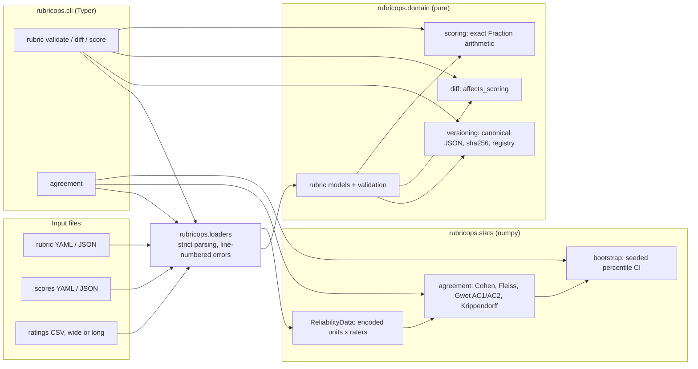

# RubricOps

[](https://github.com/vipul21435/rubricops/actions/workflows/ci.yml)


**Expert review operations for AI-training data: versioned weighted rubrics, exact
rubric scoring, and inter-rater agreement with bootstrap confidence intervals.**

When many expert reviewers grade model outputs against rubrics, data quality is
decided by the process around the grading: which rubric version a score was given
under, whether a rubric edit silently changes verdicts, and whether reviewers
actually agree with each other. RubricOps turns that process into typed, tested
software. Today it ships the rubric and statistics core with a CLI and a Docker
image; the review queue, QA sampling, calibration and web service are on the
[Roadmap](#roadmap).

## What exists today

| Area | What you get |
| --- | --- |
| Versioned rubrics | Weighted criteria, integer scales, a scoring guide with one descriptor per scale point, anchor examples, gating minimums and a pass threshold. Pydantic-validated, sha256 content-hashed over a canonical form, with an append-only version registry. |
| Rubric diff | Added and removed criteria, reweighting, rescaling, gating and threshold changes, wording edits, and a single `affects_scoring` flag usable as a CI gate. |
| Exact scoring | A `criterion -> score` map scored against a specific rubric version with exact decimals and `fractions.Fraction`, so a score that equals the threshold on paper passes. |
| Agreement statistics | Cohen's kappa (unweighted, linear, quadratic), Fleiss' kappa, Gwet's AC1, Gwet's AC2 (linear, quadratic) and Krippendorff's alpha (nominal, interval) in numpy, checked against published worked examples. AC1/AC2 keep a sane value where the kappa paradox drives Cohen/Fleiss toward zero. Degenerate data returns NaN with a reason instead of raising. |
| Bootstrap intervals | Seeded percentile bootstrap over units, with degenerate resamples skipped and counted. |
| Strict loaders | YAML/JSON rubrics and scores with duplicate keys rejected; ratings CSVs in wide or long layout with repeated units, repeated (unit, rater) pairs and malformed quoting rejected, all with line numbers. |
| CLI | `rubricops rubric validate\|diff\|score` and `rubricops agreement`, each with `--json`. |
| Packaging | A digest-pinned, non-root slim Docker image, `make demo` / `make docker-demo`, and CI that runs lint, strict typing, tests with a coverage gate, and the demo inside the image. |

## Quickstart

Requires [uv](https://docs.astral.sh/uv/) and make. These five commands were run on a
fresh clone:

```bash
git clone https://github.com/vipul21435/rubricops.git
cd rubricops
make install   # uv sync --frozen + pre-commit hooks
make check     # ruff, mypy --strict, pytest with the coverage gate
make demo      # validate, diff and score rubrics, then measure agreement
```

With Docker instead of uv: `make docker-demo` builds the image, runs the same demo in
it and prunes this project's dangling images.

## CLI usage

Every block below is real output from `make demo` (`scripts/demo.sh`) on the bundled,
original examples in [examples/](examples/).

### Rubrics: validate, diff, score

```console
$ rubricops rubric validate examples/rubrics/action-items.yaml examples/rubrics/code-explanation.v1.yaml examples/rubrics/code-explanation.yaml
ok    examples/rubrics/action-items.yaml  id=action-items criteria=4 pass_threshold=0.75 sha256=14e0f1332a8a
ok    examples/rubrics/code-explanation.v1.yaml  id=code-explanation criteria=3 pass_threshold=0.6 sha256=772003b4c66e
ok    examples/rubrics/code-explanation.yaml  id=code-explanation criteria=4 pass_threshold=0.7 sha256=15f1cde6e5fe

$ rubricops rubric diff examples/rubrics/code-explanation.v1.yaml examples/rubrics/code-explanation.yaml
code-explanation (772003b4c66e) -> code-explanation (15f1cde6e5fe)
  + added criterion safe_advice: weight 0.15, scale 0..2, gating 1
  ~ reweighted correctness: 0.5 -> 0.4
  ~ reweighted completeness: 0.3 -> 0.25
  ~ rescaled clarity: 1..3 -> 1..4
  ~ gating correctness: none -> 3
  ~ pass_threshold: 0.6 -> 0.7
  ~ guide or anchors edited: completeness
scoring affected: yes

$ rubricops rubric score examples/rubrics/code-explanation.yaml --scores examples/reviews/code-explanation-review.yaml
rubric code-explanation  sha256 15f1cde6e5fe
criterion     score  scale   weight  contribution
correctness       3  1..4     0.400        0.2667
completeness      3  1..4     0.250        0.1667
clarity           4  1..4     0.200        0.2000
safe_advice       1  0..2     0.150        0.0750
score 0.7083  threshold 0.7  -> PASS
```

- `rubric score RUBRIC -s correctness=2 ...` scores inline and overrides a `--scores`
  file.
- `rubric diff --fail-on-scoring-change OLD NEW` exits 1 when an edit can change a
  score or verdict: rewording a descriptor passes, reweighting does not.
- Exit codes: 0 success, 1 invalid rubric or scores (every problem is listed, not just
  the first), 2 usage error.

A rubric is a YAML or JSON document; see
[examples/rubrics/code-explanation.yaml](examples/rubrics/code-explanation.yaml):

```yaml
id: code-explanation
pass_threshold: 0.7
criteria:
  - id: correctness
    title: Technical correctness
    weight: 0.4            # weights are fractions of the total and must sum to 1
    scale: {low: 1, high: 4}
    gating: 3              # below 3 fails the review, whatever the total
    guide:                 # one descriptor per scale point
      - {score: 1, label: Wrong, descriptor: The core behaviour is described incorrectly.}
    anchors:               # at least one worked example per scale point
      - score: 1
        text: Says chunk() splits the list into `size` equal parts.
        rationale: It produces parts of length `size`, not `size` parts.
```

### Agreement with bootstrap intervals

`rubricops agreement FILE.csv` reads a ratings table. The wide layout is a unit column
followed by one column per reviewer
([correctness-3-reviewers.csv](examples/ratings/correctness-3-reviewers.csv): three
reviewers, 20 responses, a 1..4 scale, two gaps). The long layout has `unit`, `rater`
and `rating` columns in any order ([verdicts-long.csv](examples/ratings/verdicts-long.csv):
two reviewers' pass/fail verdicts on 16 responses).

```console
$ rubricops agreement examples/ratings/correctness-3-reviewers.csv --metric alpha-interval --metric alpha-nominal
examples/ratings/correctness-3-reviewers.csv  units=20 raters=3 categories=[1, 2, 3, 4]
metric           value  units  ratings  95% CI (2000 resamples, seed 20260929)
alpha-interval   0.835     20       58  [0.703, 0.908]
alpha-nominal    0.495     20       58  [0.278, 0.677]

$ rubricops agreement examples/ratings/verdicts-long.csv --layout long --metric cohen --metric alpha-nominal
examples/ratings/verdicts-long.csv  units=16 raters=2 categories=[fail, pass]
metric          value  units  ratings  95% CI (2000 resamples, seed 20260929)
cohen           0.492     16       32  [0.000, 0.875]
alpha-nominal   0.508     16       32  [0.031, 0.878]
```

The first file shows why the metric choice matters: the reviewers rarely agree on the
exact point (nominal alpha 0.495) but their disagreements are small (interval alpha
0.835). The second shows how wide an interval 16 items give: a kappa of 0.49 is
compatible with anything from chance to strong agreement. The last example (from
Gwet's irrCAC package) contrasts Cohen's kappa with AC1 on the same table:

```console
$ rubricops agreement examples/ratings/gwet-abstractors.csv -m ac1 -m cohen --ci 0
examples/ratings/gwet-abstractors.csv  units=100 raters=2 categories=[AIU, Ectopic, NIU]
metric   value  units  ratings
ac1      0.849    100      200
cohen    0.796    100      200
```

- `--metric` is repeatable: `cohen`, `cohen-linear`, `cohen-quadratic`, `fleiss`,
  `ac1`, `ac2-linear`, `ac2-quadratic`, `alpha-nominal` (default), `alpha-interval`.
- `--ci 0.9` sets the confidence level (`--ci 0` skips the bootstrap), `--resamples`
  the count and `--seed` the seed (default `RUBRICOPS_RANDOM_SEED`). The same seed
  always prints the same interval.
- A metric that cannot apply to the data (Cohen's kappa on three reviewers, Fleiss'
  kappa on uneven ratings) prints `error: ...` on its own line and makes the exit code
  1; the other metrics still print. A metric that is undefined on the data (every
  rating identical) prints `n/a` with the reason.
- `--json` prints the full result: observed and expected disagreement, counts,
  categories, the interval and the number of degenerate resamples skipped.

## Architecture



The domain and stats packages do no I/O; the loaders are the only code that touches
files and the CLI only wires them together and formats output. That split is what
lets the planned service layer (see the Roadmap) reuse the same code unchanged.

## Measured numbers

Measured on 2026-09-29 on an Apple M2 laptop; each row names the command that
reproduces it.

| What | Result | Command |
| --- | --- | --- |
| Tests | 537 passed | `make cov` |
| Coverage (line and branch) | 100% of 1600 statements, 99.95% of 343 branches (the gate is 85%) | `make cov` |
| Static checks | ruff clean, `mypy --strict` clean on 25 source files | `make lint typecheck` |
| End-to-end demo | 1.7 s wall time | `time make demo` |
| Bootstrap | 20,000 resamples of interval alpha on the 20-unit example in 0.8-1.1 s, including CLI start-up (three runs) | `time uv run rubricops agreement examples/ratings/correctness-3-reviewers.csv -m alpha-interval --resamples 20000` |
| Docker image | 72 MB content size (71,996,734 bytes) | `docker image inspect rubricops:dev --format '{{.Size}}'` |

The statistics tests reproduce published worked examples, with the source cited in
each test docstring: Krippendorff (2011) nominal alpha 0.743 and interval alpha 0.849
(and its coincidence matrix), a 14-rater Fleiss example (0.210) and a two-reader
Cohen example (0.4). Hypothesis properties cover relabelling and affine invariance,
kappa = 1 for identical raters, the exact Fleiss/alpha relation on complete data, and
that a rubric score stays in [0, 1] and rises with every criterion.

## Design decisions

- **Rubric versions are immutable and content-addressed.** The hash is sha256 over a
  canonical JSON form (sorted keys, trimmed text, guide levels in scale order), so
  re-indenting a file is not a new version, while reordering criteria is (it changes
  the review form). Publishing an unchanged head is refused; a revert is a new
  version that shares an old hash.
- **Scores are exact.** Weights are read back as the shortest round-tripping decimal
  and combined with `Fraction`, so `0.7 + 0.2 + 0.1` sums to exactly 1 and a score
  equal to the threshold passes. Floats appear only in reported values.
- **Loaders refuse to guess.** A duplicate YAML key, a repeated CSV unit or a
  malformed quote is an error with a line number, never "last one wins", because a
  silently different rubric or ratings table is worse than a failed run.
- **Degenerate is not an error.** When every usable rating is the same category, a
  kappa is 0/0: the result is NaN with a reason, and the CLI prints `n/a (...)`.
  Malformed input (wrong rater count, text on an interval metric) does raise.
- **Resample units, not ratings.** Ratings of one item are correlated; items are the
  sampling unit. Ratings are encoded once against a fixed category list so every
  resample keeps the full data's categories and weights. The seed is mandatory.
- **Light dependencies.** numpy, pydantic, PyYAML and Typer at runtime; no scipy or
  pandas. Every statistic is a few lines of array code that can be checked against
  the formula in its docstring.
- **Strict tooling from the first commit.** ruff with a broad rule set, `mypy
  --strict`, `filterwarnings = error` in pytest and an 85% branch-coverage gate, all
  enforced in CI.

## Roadmap

Planned in [PLAN.md](PLAN.md) and **not built yet**:

- **Persistence and review pipeline (slice 3):** SQLAlchemy 2 models and Alembic
  migrations; a primary review -> QA audit -> adjudication state machine with role
  guards; an append-only, hash-chained audit log.
- **Review queue (slice 4):** round-robin, skill-tag and load-balanced assignment,
  SLAs with overdue detection, and seeded QA sampling that records why each item was
  sampled.
- **Reviewer calibration (slice 5):** accuracy against gold items, per-criterion
  leniency and harshness with bootstrap CIs, drift alerts and reviewer scorecards.
- **Service and UI (slice 6):** FastAPI with JWT roles, an HTMX reviewer queue and
  lead dashboard, CSV/JSONL export.
- **Seeded demo and compose (rest of slice 7):** a deterministic demo dataset,
  docker-compose with Postgres, and an HTTP end-to-end demo.
- **Benchmarks and docs (slice 8):** `make bench`, generated pipeline docs and ADRs.

`.env.example` already lists settings for these slices (database URL, JWT, QA sample
rate, SLA); today only `RUBRICOPS_RANDOM_SEED` is used.

## Development

```bash
make help          # list targets
make format        # apply ruff fixes and formatting
make typecheck     # mypy --strict on src/
make cov           # tests with branch coverage (fails under 85%)
make docker-build  # build rubricops:dev
```

## Project layout

```
src/rubricops/
  domain/        pure logic: rubric models, versioning, diff, scoring, clock
  stats/         reliability data, agreement coefficients, bootstrap
  cli/           Typer commands: rubric validate|diff|score, agreement
  loaders.py     strict YAML/JSON and ratings CSV loading
  settings.py    typed RUBRICOPS_* configuration
examples/        original rubrics, a sample review and two ratings tables
scripts/demo.sh  the end-to-end demo behind make demo and make docker-demo
tests/           pytest + hypothesis suite
PLAN.md          design decisions and the implementation slices
```

## License

MIT. See [LICENSE](LICENSE).
