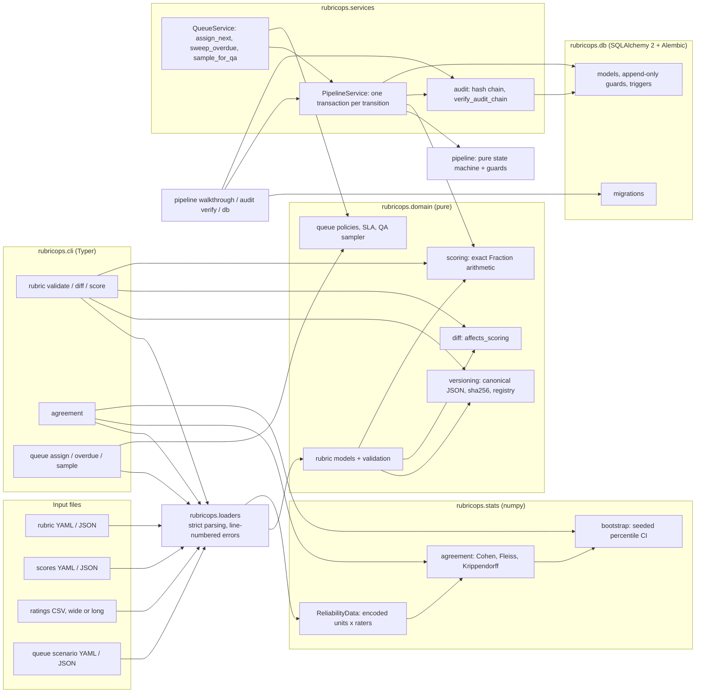

# RubricOps

[](https://github.com/vipul21435/rubricops/actions/workflows/ci.yml)


**Expert review operations for AI-training data: versioned weighted rubrics, exact
rubric scoring, a primary review -> QA audit -> adjudication pipeline with a
tamper-evident audit log, and inter-rater agreement with bootstrap confidence
intervals.**

When many expert reviewers grade model outputs against rubrics, data quality is
decided by the process around the grading: which rubric version a score was given
under, whether a rubric edit silently changes verdicts, and whether reviewers
actually agree with each other. RubricOps turns that process into typed, tested
software. Today it ships the rubric and statistics core, a persisted review pipeline
whose every transition lands on a hash-chained audit log, review-queue assignment
policies with SLAs and reasoned QA sampling, reviewer calibration against gold items
that feeds the QA sampler, a CLI and a Docker image; the web service is on the
[Roadmap](#roadmap).

## What exists today

| Area | What you get |
| --- | --- |
| Versioned rubrics | Weighted criteria, integer scales, a scoring guide with one descriptor per scale point, anchor examples, gating minimums and a pass threshold. Pydantic-validated, sha256 content-hashed over a canonical form, with an append-only version registry. |
| Rubric diff | Added and removed criteria, reweighting, rescaling, gating and threshold changes, wording edits, and a single `affects_scoring` flag usable as a CI gate. |
| Exact scoring | A `criterion -> score` map scored against a specific rubric version with exact decimals and `fractions.Fraction`, so a score that equals the threshold on paper passes. |
| Agreement statistics | Cohen's kappa (unweighted, linear, quadratic), Fleiss' kappa and Krippendorff's alpha (nominal, interval) in numpy, checked against published worked examples. Degenerate data returns NaN with a reason instead of raising. |
| Bootstrap intervals | Seeded percentile bootstrap over units, with degenerate resamples skipped and counted. |
| Review pipeline | A pure state machine: queued -> assigned -> in_review -> reviewed -> finalized, or via qa_pending -> qa_passed / qa_failed -> in_adjudication -> finalized, plus returned_to_author and resubmission as a new round. Role and independence guards: nobody reviews their own submission, only the assignee submits the primary review, the QA auditor is not the primary reviewer, and the adjudicator is a lead who reviewed neither side. QA passes only when the verdicts match and the exact (rational) scores are within a tolerance, so 11/15 vs 5/6 is exactly 0.1 apart. |
| Persistence | Typed SQLAlchemy 2 models (users, rubrics and immutable versions, submissions, assignments, reviews, gold items, audit events) with CHECK constraints, SQLite foreign keys and WAL, and an Alembic migration shipped inside the package. |
| Audit log | Each transition runs in one transaction: a Review pinned to the submission's rubric version, the final score (primary, or adjudicated after a QA disagreement) and one audit event with `hash = sha256(prev_hash + canonical event)`. Optimistic locking rejects a stale or racing double submit with `StaleSubmission`, including two reviewers racing to write the same review. The log and rubric versions are append-only through ORM guards and database triggers, and `verify_audit_chain` names the first broken link, including a payload that is no longer a JSON object. |
| Review queue | Round-robin (a persisted cursor that is the last assigned reviewer id), skill-tag match (tags must cover the item's; ties by open load, then id) and load-balanced assignment with per-reviewer capacity caps. Every policy excludes the author and, for QA, the primary reviewer, and a refusal is a typed `NoEligibleReviewer` naming why each candidate was excluded. On the database, `QueueService.assign_next`, `sweep_overdue` and `sample_for_qa` act through the pipeline service, so every queue decision is an audited transition whose event records the policy and cursor, or the sampling reasons, draw, rate and seed. |
| SLAs | A default turnaround (`RUBRICOPS_REVIEW_SLA_HOURS`) with per-rubric overrides; overdue detection reads an injected clock and returns an escalation list sorted by lateness. |
| QA sampling | A seeded random rate (`RUBRICOPS_QA_SAMPLE_RATE`) plus risk rules: a new reviewer, a calibration flag, a score near the pass threshold (exact decimals) and a wide score spread on the item. Each decision records every reason, the draw and the rate; draws are keyed on seed, submission and round, so decisions do not depend on batch order. |
| Reviewer calibration | From gold items with panel scores: per-reviewer exact-match rate, per-criterion MAE and pass/fail agreement; per-criterion mean signed error with a seeded bootstrap CI (reusing the stats bootstrap), called lenient or harsh only when the CI excludes 0; drift alerts when the MAE of the last window of gold reviews rises past a threshold; and scorecards with quadratic-weighted Cohen's kappa and interval Krippendorff's alpha against every peer. Flagged reviewers feed the QA sampler's `calibration_flag` rule. |
| Strict loaders | YAML/JSON rubrics and scores with duplicate keys rejected; ratings CSVs in wide or long layout with repeated units, repeated (unit, rater) pairs and malformed quoting rejected, all with line numbers. |
| CLI | `rubricops rubric validate\|diff\|score` and `rubricops agreement` (each with `--json`), `rubricops db upgrade\|downgrade\|current`, `rubricops pipeline walkthrough`, `rubricops audit verify`, `rubricops queue assign\|overdue\|sample` and `rubricops calibration report`. |
| Packaging | A digest-pinned, non-root slim Docker image, `make demo` / `make docker-demo`, and CI that runs lint, strict typing, tests with a coverage gate, and the demo inside the image. |

## Quickstart

Requires [uv](https://docs.astral.sh/uv/) and make. These five commands were run on a
fresh clone:

```bash
git clone https://github.com/vipul21435/rubricops.git
cd rubricops
make install   # uv sync --frozen + pre-commit hooks
make check     # ruff, mypy --strict, pytest with the coverage gate
make demo      # rubrics, scoring, agreement, the queue, then the pipeline and audit check
```

With Docker instead of uv: `make docker-demo` builds the image, runs the same demo in
it and prunes this project's dangling images.

## CLI usage

Every block below is real output from `make demo` (`scripts/demo.sh`) on the bundled,
original examples in [examples/](examples/).

### Rubrics: validate, diff, score

```console
$ rubricops rubric validate examples/rubrics/action-items.yaml examples/rubrics/code-explanation.v1.yaml examples/rubrics/code-explanation.yaml
ok    examples/rubrics/action-items.yaml  id=action-items criteria=4 pass_threshold=0.75 sha256=14e0f1332a8a
ok    examples/rubrics/code-explanation.v1.yaml  id=code-explanation criteria=3 pass_threshold=0.6 sha256=772003b4c66e
ok    examples/rubrics/code-explanation.yaml  id=code-explanation criteria=4 pass_threshold=0.7 sha256=15f1cde6e5fe

$ rubricops rubric diff examples/rubrics/code-explanation.v1.yaml examples/rubrics/code-explanation.yaml
code-explanation (772003b4c66e) -> code-explanation (15f1cde6e5fe)
  + added criterion safe_advice: weight 0.15, scale 0..2, gating 1
  ~ reweighted correctness: 0.5 -> 0.4
  ~ reweighted completeness: 0.3 -> 0.25
  ~ rescaled clarity: 1..3 -> 1..4
  ~ gating correctness: none -> 3
  ~ pass_threshold: 0.6 -> 0.7
  ~ guide or anchors edited: completeness
scoring affected: yes

$ rubricops rubric score examples/rubrics/code-explanation.yaml --scores examples/reviews/code-explanation-review.yaml
rubric code-explanation  sha256 15f1cde6e5fe
criterion     score  scale   weight  contribution
correctness       3  1..4     0.400        0.2667
completeness      3  1..4     0.250        0.1667
clarity           4  1..4     0.200        0.2000
safe_advice       1  0..2     0.150        0.0750
score 0.7083  threshold 0.7  -> PASS
```

- `rubric score RUBRIC -s correctness=2 ...` scores inline and overrides a `--scores`
  file.
- `rubric diff --fail-on-scoring-change OLD NEW` exits 1 when an edit can change a
  score or verdict: rewording a descriptor passes, reweighting does not.
- Exit codes: 0 success, 1 invalid rubric or scores (every problem is listed, not just
  the first), 2 usage error.

A rubric is a YAML or JSON document; see
[examples/rubrics/code-explanation.yaml](examples/rubrics/code-explanation.yaml):

```yaml
id: code-explanation
pass_threshold: 0.7
criteria:
  - id: correctness
    title: Technical correctness
    weight: 0.4            # weights are fractions of the total and must sum to 1
    scale: {low: 1, high: 4}
    gating: 3              # below 3 fails the review, whatever the total
    guide:                 # one descriptor per scale point
      - {score: 1, label: Wrong, descriptor: The core behaviour is described incorrectly.}
    anchors:               # at least one worked example per scale point
      - score: 1
        text: Says chunk() splits the list into `size` equal parts.
        rationale: It produces parts of length `size`, not `size` parts.
```

### Agreement with bootstrap intervals

`rubricops agreement FILE.csv` reads a ratings table. The wide layout is a unit column
followed by one column per reviewer
([correctness-3-reviewers.csv](examples/ratings/correctness-3-reviewers.csv): three
reviewers, 20 responses, a 1..4 scale, two gaps). The long layout has `unit`, `rater`
and `rating` columns in any order ([verdicts-long.csv](examples/ratings/verdicts-long.csv):
two reviewers' pass/fail verdicts on 16 responses).

```console
$ rubricops agreement examples/ratings/correctness-3-reviewers.csv --metric alpha-interval --metric alpha-nominal
examples/ratings/correctness-3-reviewers.csv  units=20 raters=3 categories=[1, 2, 3, 4]
metric           value  units  ratings  95% CI (2000 resamples, seed 20260929)
alpha-interval   0.835     20       58  [0.703, 0.908]
alpha-nominal    0.495     20       58  [0.278, 0.677]

$ rubricops agreement examples/ratings/verdicts-long.csv --layout long --metric cohen --metric alpha-nominal
examples/ratings/verdicts-long.csv  units=16 raters=2 categories=[fail, pass]
metric          value  units  ratings  95% CI (2000 resamples, seed 20260929)
cohen           0.492     16       32  [0.000, 0.875]
alpha-nominal   0.508     16       32  [0.031, 0.878]
```

The first file shows why the metric choice matters: the reviewers rarely agree on the
exact point (nominal alpha 0.495) but their disagreements are small (interval alpha
0.835). The second shows how wide an interval 16 items give: a kappa of 0.49 is
compatible with anything from chance to strong agreement.

- `--metric` is repeatable: `cohen`, `cohen-linear`, `cohen-quadratic`, `fleiss`,
  `alpha-nominal` (default), `alpha-interval`.
- `--ci 0.9` sets the confidence level (`--ci 0` skips the bootstrap), `--resamples`
  the count and `--seed` the seed (default `RUBRICOPS_RANDOM_SEED`). The same seed
  always prints the same interval.
- A metric that cannot apply to the data (Cohen's kappa on three reviewers, Fleiss'
  kappa on uneven ratings) prints `error: ...` on its own line and makes the exit code
  1; the other metrics still print. A metric that is undefined on the data (every
  rating identical) prints `n/a` with the reason.
- `--json` prints the full result: observed and expected disagreement, counts,
  categories, the interval and the number of degenerate resamples skipped.

### Review queue: assignment, overdue work, QA sampling

The queue commands run on a scenario file: a snapshot of reviewers (skills, open
load, capacity, completed reviews, calibration flag), queued items, handed-out
assignments and primary reviews awaiting the finalize-or-QA decision. The example,
[examples/queue/scenario.yaml](examples/queue/scenario.yaml), is made up.

```console
$ rubricops queue assign examples/queue/scenario.yaml --policy skill-match
policy skill-match: 5 of 7 assigned
    item  stage    tags               assigned to
     101  primary  python             bruno (12)
     102  primary  python,sql         asha (11)
     103  qa       python             asha (11)
     104  primary  docs               emeka (15)
     105  primary  rust               UNASSIGNED (asha=at_capacity, bruno=missing_skills, chen=missing_skills, dara=at_capacity, emeka=at_capacity)
     106  qa       python,sql         UNASSIGNED (asha=primary_reviewer, bruno=missing_skills, chen=missing_skills, dara=at_capacity, emeka=at_capacity)
     107  primary  sql                chen (13)
open loads after: asha=4, bruno=1, chen=2, dara=3, emeka=2

$ rubricops queue overdue examples/queue/scenario.yaml
as of 2026-09-29 09:00 UTC: 3 of 5 open assignments overdue (default SLA 24h)
    item  stage    reviewer     due (UTC)         late by
      91  primary  chen         2026-09-28 08:30  1d 00h 30m
      94  qa       emeka        2026-09-28 18:00  15h 00m
      90  primary  asha         2026-09-29 04:00  05h 00m

$ rubricops queue sample examples/queue/scenario.yaml --seed 20260929 --rate 0.1
seed 20260929, rate 0.1: 4 of 8 sent to QA
      80  finalize  asha     none                            draw 0.1740 >= rate 0.1
      81  QA        bruno    random+new_reviewer             draw 0.0892 < rate 0.1; 6 completed reviews < 20
      82  QA        chen     near_threshold                  score 0.7200 within 0.05 of threshold 0.7
      83  QA        dara     low_agreement                   item scores span 0.3500 > 0.25
      84  QA        emeka    calibration_flag+near_threshold reviewer flagged by calibration; score 0.8000 within 0.05 of threshold 0.75
      85  finalize  asha     none                            draw 0.9201 >= rate 0.1
      86  finalize  chen     none                            draw 0.8365 >= rate 0.1
      87  finalize  dara     none                            draw 0.9086 >= rate 0.1
```

- `--policy round-robin|skill-match|load-balanced` (default load-balanced). Each
  assignment counts towards the reviewer's open load for the rest of the batch, so
  capacity caps hold. Round-robin prints `cursor: ID`; pass it back with `--cursor`
  to continue where the last run stopped.
- `overdue` checks as of the scenario's `now` (or `--now`, else the system clock).
  Assignment 90 uses the 8-hour `code-explanation` override, so it is due at 04:00
  and five hours late; 93 is on the same rubric but not due until 10:00. Completed
  assignments are skipped.
- `sample` takes `--rate` and `--seed` (defaults from `RUBRICOPS_QA_SAMPLE_RATE` and
  `RUBRICOPS_RANDOM_SEED`) and the risk-rule knobs `--min-reviews`, `--margin` and
  `--max-spread`. Items with no reason are finalized; the draw is still printed.

### Reviewer calibration against gold items

`rubricops calibration report` reads gold items with panel scores
([gold.yaml](examples/calibration/gold.yaml)) and reviewers' blind reviews of them
([reviews.yaml](examples/calibration/reviews.yaml)). The example data is synthetic and
seeded (`scripts/gen_calibration_example.py`): 24 gold items of `code-explanation`,
five reviewers, with chen one point lenient on clarity, bruno one point harsh on
correctness and emeka drifting one point low halfway through.

```console
$ rubricops calibration report --reviewer chen
rubric code-explanation: 5 reviewers, 95% bootstrap CIs (2000 resamples, seed 7)

chen: 24 gold reviews, exact match 0.38, pass/fail agreement 0.88
  criterion        MAE   mean error  CI                bias
  correctness    0.125      +0.042  [-0.083, +0.208]  neutral
  completeness   0.083      +0.000  [-0.125, +0.125]  neutral
  clarity        0.625      +0.625  [+0.417, +0.792]  lenient
  safe_advice    0.042      -0.042  [-0.125, +0.000]  neutral
  vs asha     kappa(quadratic) +0.911  alpha(interval) +0.911  on 96 ratings
  vs bruno    kappa(quadratic) +0.809  alpha(interval) +0.806  on 96 ratings
  vs dara     kappa(quadratic) +0.895  alpha(interval) +0.895  on 96 ratings
  vs emeka    kappa(quadratic) +0.790  alpha(interval) +0.783  on 96 ratings
  flags: clarity lenient

flagged for QA: bruno, chen, emeka

$ rubricops calibration report --reviewer emeka | grep -E "drift|flags"
  drift: emeka: mean absolute error rose +0.525 (0.175 -> 0.700) over the last 10 gold reviews, threshold 0.5
  flags: correctness harsh, completeness harsh, clarity harsh, safe_advice harsh, drift
```

- A criterion is `lenient` or `harsh` only when the whole bootstrap interval of the
  mean signed error (reviewer minus gold) is above or below 0; asha and dara, who
  are unbiased with some noise, are not flagged. `--resamples` and `--seed` set the
  bootstrap, `--window` and `--drift-threshold` the drift check, and a pass/fail
  agreement below 0.8 is also a flag.
- Peer agreement uses the (item, criterion) scores both reviewers gave.
- `--format json` prints the same report as JSON, and `rubricops queue sample
  --flags report.json` reads its `flagged` list: on the queue example with `--rate 0`
  it sends 5 of 8 items to QA instead of 4, with the `calibration_flag` reason.

### Review pipeline and audit log

`rubricops pipeline walkthrough` migrates a new database, adds five users and the
`code-explanation` rubric, and takes three submissions down the three routes: primary
review only, QA confirms, and QA disagrees so a lead adjudicates. It also shows two
refusals. The clock is a stepping clock from a fixed instant, so every run (on macOS
and in the Linux image) ends at the same head hash. Scores come from
[walkthrough-scores.yaml](examples/reviews/walkthrough-scores.yaml).

```console
$ rubricops pipeline walkthrough --url sqlite:///var/walkthrough.db
published rubric code-explanation v1 as rubric_version 1

submission 1 (primary review only) queued by author-1
  assign                   queued -> assigned         by lead-1     v2 event #8  -> reviewer-1
  start                  assigned -> in_review        by reviewer-1 v3 event #9
  submit_primary        in_review -> reviewed         by reviewer-1 v4 event #10  score 0.7083 PASS
  finalize               reviewed -> finalized        by lead-1     v5 event #11
  refused: submission 1 is at version 5, not version 4; reload and retry

submission 2 (QA confirms) queued by author-1
  assign                   queued -> assigned         by lead-1     v2 event #13  -> reviewer-1
  start                  assigned -> in_review        by reviewer-1 v3 event #14
  submit_primary        in_review -> reviewed         by reviewer-1 v4 event #15  score 0.8500 PASS
  send_to_qa             reviewed -> qa_pending       by lead-1     v5 event #16
  submit_qa            qa_pending -> qa_passed        by reviewer-2 v6 event #17  score 0.9167 PASS
  finalize              qa_passed -> finalized        by lead-1     v7 event #18

submission 3 (QA disagrees) queued by author-1
  assign                   queued -> assigned         by lead-1     v2 event #20  -> reviewer-1
  start                  assigned -> in_review        by reviewer-1 v3 event #21
  submit_primary        in_review -> reviewed         by reviewer-1 v4 event #22  score 0.8500 PASS
  send_to_qa             reviewed -> qa_pending       by lead-1     v5 event #23
  refused: submit_qa forbidden by auditor_is_not_primary: user 4 wrote the primary review and cannot audit it
  submit_qa            qa_pending -> qa_failed        by reviewer-2 v6 event #24  score 0.5083 FAIL
  escalate              qa_failed -> in_adjudication  by lead-1     v7 event #25
  adjudicate      in_adjudication -> finalized        by lead-2     v8 event #26  score 0.6417 FAIL

submission  status     final score  verdict  decided by
         1  finalized       0.7083  PASS     primary review
         2  finalized       0.8500  PASS     primary review
         3  finalized       0.6417  FAIL     adjudication review

audit chain ok: 26 events, head seq 26 hash f3b4e8815a25
```

The QA audit on submission 2 is 0.067 away from the primary score with the same
verdict, inside the default 0.1 tolerance, so the primary score stands. On
submission 3 the auditor's correctness score fails the rubric's gate, the verdicts
differ, and the adjudicated score becomes final. `v2`..`v8` is the submission's
optimistic-lock version; the refused `finalize` reused a version that was already
spent.

Tampering with the log, on the same database:

```console
$ rubricops audit verify --url sqlite:///var/walkthrough.db
ok: 26 events, head seq 26 hash f3b4e8815a25
anchor: 26:f3b4e8815a2545adc53deebc1dccd9dd2abb992ccf6f1d4304a17956f090232c

$ sqlite3 var/walkthrough.db "UPDATE audit_events SET data = json_set(data, '$.final_passed', json('true')) WHERE seq = 26"
Error: stepping, audit_events is append-only (19)

$ sqlite3 var/walkthrough.db "DROP TRIGGER audit_events_no_update; UPDATE audit_events SET data = json_set(data, '$.final_passed', json('true')) WHERE seq = 26"

$ rubricops audit verify --url sqlite:///var/walkthrough.db
BROKEN at seq 26: hash does not match the event's content (25 events checked)
```

- `audit verify` exits 1 on a broken chain. Deleting old events shows up as a gap.
  Deleting the newest ones leaves a shorter chain that is still valid on its own, so
  keep the printed `anchor` somewhere else and pass it back with `--anchor SEQ:HASH`
  to catch that too.
- `audit verify` on a missing SQLite file or a database without the audit table
  exits 1 with a message and creates nothing. `pipeline walkthrough` checks first
  that custom `--scores` take the three scripted routes, so a bad file never leaves
  a half-written database.
- `rubricops db upgrade|downgrade|current [--url URL]` runs the packaged Alembic
  migrations (`--sql` prints the DDL instead). `--url` defaults to
  `RUBRICOPS_DATABASE_URL`.

## Architecture



The domain and stats packages do no I/O: the state machine decides a transition
from plain facts, and scoring works on a rubric value. The services layer is the only
code that opens transactions; it loads facts, calls the domain, and writes reviews
and audit events. The loaders are the only code that reads user files, and the CLI
only wires things together and formats output.

## Measured numbers

Measured on 2026-09-29 on an Apple M2 laptop; each row names the command that
reproduces it.

| What | Result | Command |
| --- | --- | --- |
| Tests | 689 passed | `make cov` |
| Coverage (line and branch) | 100% of 2896 statements and 606 branches (the gate is 85%) | `make cov` |
| Static checks | ruff clean, `mypy --strict` clean on 38 source files | `make lint typecheck` |
| End-to-end demo | 4.5-5.6 s wall time over three runs, including the queue commands and the pipeline walkthrough | `time make demo` |
| Pipeline walkthrough | 26 audit events, head hash `f3b4e8815a25`, identical on macOS and in the image | `make demo`, `make docker-demo` |
| Bootstrap | 20,000 resamples of interval alpha on the 20-unit example in 0.8-1.1 s, including CLI start-up (three runs) | `time uv run rubricops agreement examples/ratings/correctness-3-reviewers.csv -m alpha-interval --resamples 20000` |
| QA sampling rate | 1044 of 10,000 risk-free reviews sampled at rate 0.1 with seed 20260929 (expected 1000, one standard deviation 30); the test suite checks rates 0.05, 0.1 and 0.5 against 4-sigma binomial bounds | `uv run python -c "from rubricops.domain.sampling import *; s = QaSampler(SamplingRules(rate=0.1), 20260929); print(sum(d.sampled for d in s.decide_all(SampleCandidate(i, 1, 0.9, 0.7, 100) for i in range(10_000))))"` |
| Docker image | 81 MB content size (81,050,772 bytes) | `docker image inspect rubricops:dev --format '{{.Size}}'` |

The statistics tests reproduce published worked examples, with the source cited in
each test docstring: Krippendorff (2011) nominal alpha 0.743 and interval alpha 0.849
(and its coincidence matrix), a 14-rater Fleiss example (0.210) and a two-reader
Cohen example (0.4). Hypothesis properties cover relabelling and affine invariance,
kappa = 1 for identical raters, the exact Fleiss/alpha relation on complete data, and
that a rubric score stays in [0, 1] and rises with every criterion.

The pipeline tests check all 110 (status, action) pairs and the role matrix against a
table written out in the test, check QA agreement on every same-verdict pair of all
three bundled rubrics at tolerances 0.05, 0.1 and 0.2 on exact scores, race two
threads on the same review on a file database, and tamper with the log in four ways
(plus payloads that are not JSON objects): an edited
payload, a forged event with a recomputed hash, a deleted event and a truncated tail.
A hypothesis random walk drives the service with legal and illegal actions by random
users and checks that each applied transition adds exactly one audit event and one
version, that refusals write nothing, that the chain verifies, and that nothing is
finalized without a primary review in the current round. The migration tests run
upgrade, downgrade and upgrade again, and check that autogenerate finds no drift from
the models.

The queue tests check, for every policy, that the author and the primary reviewer are
never chosen and that a refusal names each candidate's exclusion; hypothesis
properties check that round-robin shares out work within one item per reviewer and
that load balancing never gives work to a reviewer while a lighter one is eligible.
SLA tests run on a frozen clock (due exactly now is not late, one second later is).
The sampler tests check that every applicable reason is recorded, that the same seed
gives the same decisions in any order, and the binomial bounds above. The queue
service tests run on SQLite: round-robin resumes from the last assignment row, a
per-rubric SLA sets `due_at`, a completed review leaves the overdue list, and a
second-round review is sent to QA because the item's first-round scores disagree.

## Design decisions

- **Rubric versions are immutable and content-addressed.** The hash is sha256 over a
  canonical JSON form (sorted keys, trimmed text, guide levels in scale order), so
  re-indenting a file is not a new version, while reordering criteria is (it changes
  the review form). Publishing an unchanged head is refused; a revert is a new
  version that shares an old hash.
- **Scores are exact.** Weights are read back as the shortest round-tripping decimal
  and combined with `Fraction`, so `0.7 + 0.2 + 0.1` sums to exactly 1 and a score
  equal to the threshold passes. Floats appear only in reported values.
- **Loaders refuse to guess.** A duplicate YAML key, a repeated CSV unit or a
  malformed quote is an error with a line number, never "last one wins", because a
  silently different rubric or ratings table is worse than a failed run.
- **Degenerate is not an error.** When every usable rating is the same category, a
  kappa is 0/0: the result is NaN with a reason, and the CLI prints `n/a (...)`.
  Malformed input (wrong rater count, text on an interval metric) does raise.
- **Resample units, not ratings.** Ratings of one item are correlated; items are the
  sampling unit. Ratings are encoded once against a fixed category list so every
  resample keeps the full data's categories and weights. The seed is mandatory.
- **The pipeline is a table, not a tangle of ifs.** Every legal (status, action) pair
  maps to a target, the allowed roles and named guards, so a refusal says which rule
  failed and the whole table is testable without a database.
- **Every transition is one transaction.** The review row, the status change, the
  final score and the audit event commit together or not at all. The caller passes
  the version it read; a stale version is rejected up front, and SQLAlchemy's
  version column catches a writer that races between the read and the write.
- **Reviews are pinned to a rubric version.** A submission records the version it is
  judged against, and every review is scored against that version's stored body
  (re-checked against its hash), never against the rubric's latest version.
- **The audit log is tamper-evident, not just append-only.** Triggers stop casual
  edits. Someone who can drop the triggers can still change a row, but the change
  breaks the hash chain at that row, and an anchor recorded elsewhere catches
  truncation.
- **Light dependencies.** numpy, pydantic, PyYAML, Typer, SQLAlchemy and Alembic at
  runtime; no scipy or pandas. Every statistic is a few lines of array code that can be checked against
  the formula in its docstring.
- **Strict tooling from the first commit.** ruff with a broad rule set, `mypy
  --strict`, `filterwarnings = error` in pytest and an 85% branch-coverage gate, all
  enforced in CI.

## Roadmap

Planned in [PLAN.md](PLAN.md) and **not built yet**:

- **Queue commands on a live database:** `QueueService` exists and is tested on
  SQLite, but `rubricops queue` still reads scenario files; a `--url` mode will run
  the same commands against the database.
- **Calibration history and pipeline scorecard fields (rest of slice 5):**
  persisted calibration snapshots so drift is computed from stored history, gold
  reviews read from the database instead of files, and scorecard fields that come
  from pipeline history (QA and adjudication quality, throughput, on-time rate).
- **Service and UI (slice 6):** FastAPI with JWT roles, an HTMX reviewer queue and
  lead dashboard, CSV/JSONL export.
- **Seeded demo and compose (rest of slice 7):** a deterministic demo dataset,
  docker-compose with Postgres, and an HTTP end-to-end demo. The Postgres
  append-only triggers are already in the migration but, until the Postgres CI job
  lands, only the SQLite triggers are exercised by tests.
- **Benchmarks and docs (slice 8):** `make bench`, generated pipeline docs and ADRs.

`.env.example` already lists the JWT settings for slice 6. Today
`RUBRICOPS_DATABASE_URL` (the default for `db` and `audit verify`),
`RUBRICOPS_RANDOM_SEED`, `RUBRICOPS_QA_SAMPLE_RATE` and `RUBRICOPS_REVIEW_SLA_HOURS`
are used.

## Development

```bash
make help          # list targets
make format        # apply ruff fixes and formatting
make typecheck     # mypy --strict on src/
make cov           # tests with branch coverage (fails under 85%)
make docker-build  # build rubricops:dev
```

## Project layout

```
src/rubricops/
  domain/        pure logic: rubric models, versioning, diff, scoring, pipeline, clock,
                 queue policies, SLAs, QA sampling, calibration
  stats/         reliability data, agreement coefficients, bootstrap
  db/            SQLAlchemy models, engine and sessions, Alembic migrations
  services/      pipeline transactions, queue service, audit hash chain, the walkthrough
  cli/           Typer commands: rubric, agreement, db, pipeline, audit, queue, calibration
  loaders.py     strict YAML/JSON and ratings CSV loading
  scenario.py    queue scenario files for the queue commands
  settings.py    typed RUBRICOPS_* configuration
examples/        original rubrics, sample scores, two ratings tables, a queue scenario
                 and a synthetic gold set for calibration
scripts/         demo.sh (behind make demo and make docker-demo) and the seeded
                 calibration example generator
tests/           pytest + hypothesis suite
PLAN.md          design decisions and the implementation slices
```

## License

MIT. See [LICENSE](LICENSE).
